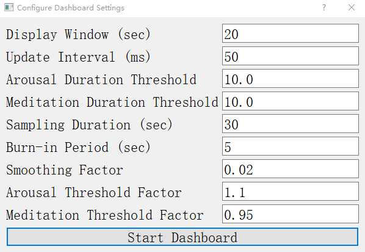
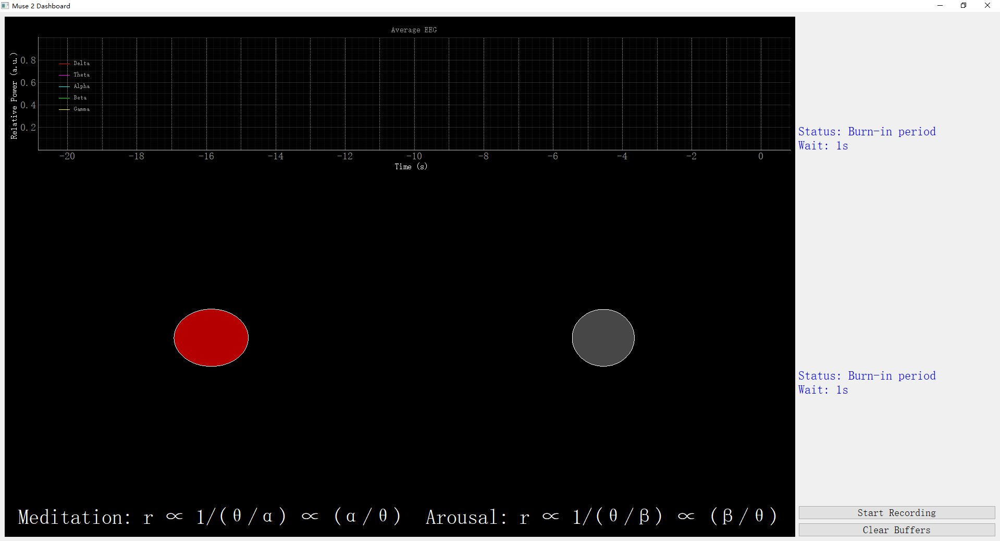
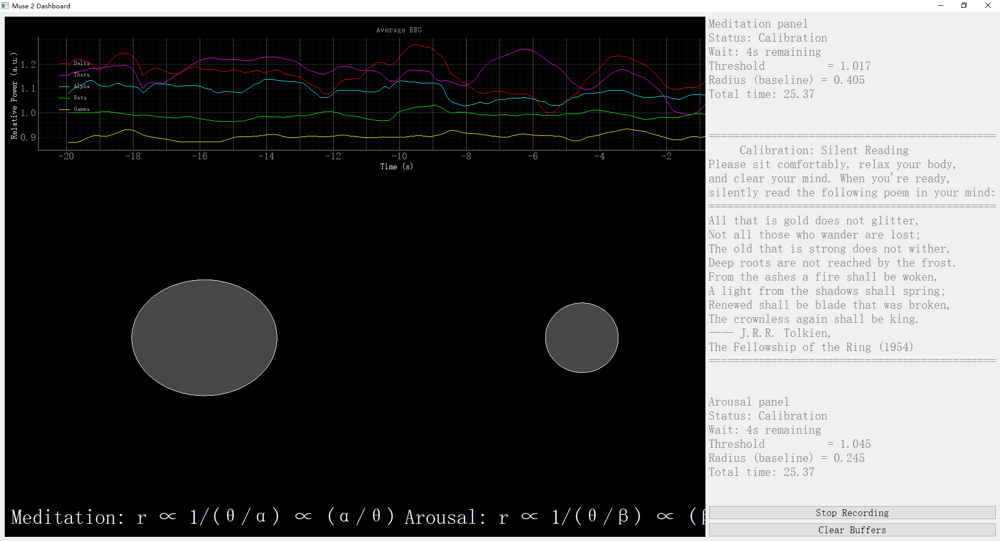
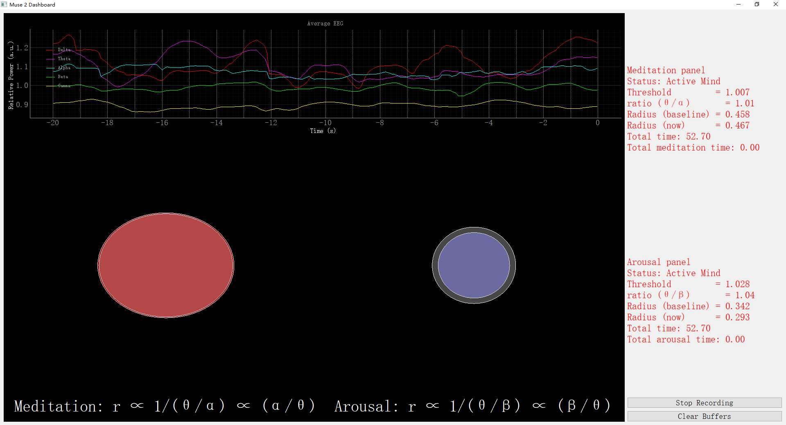
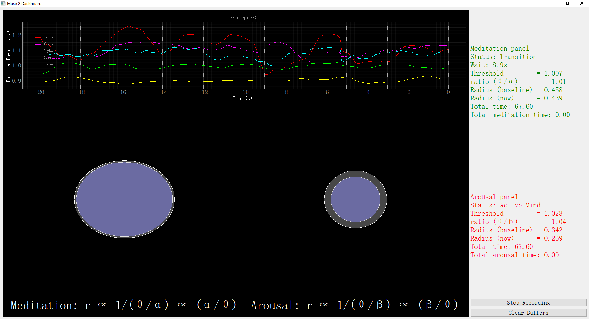
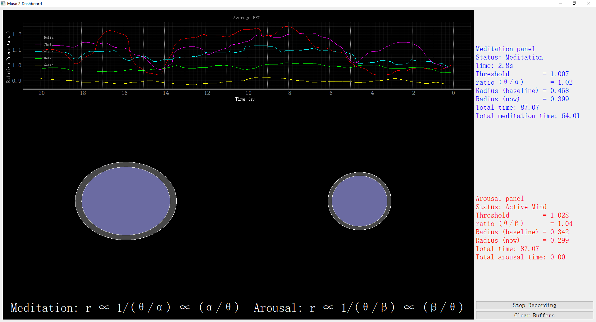
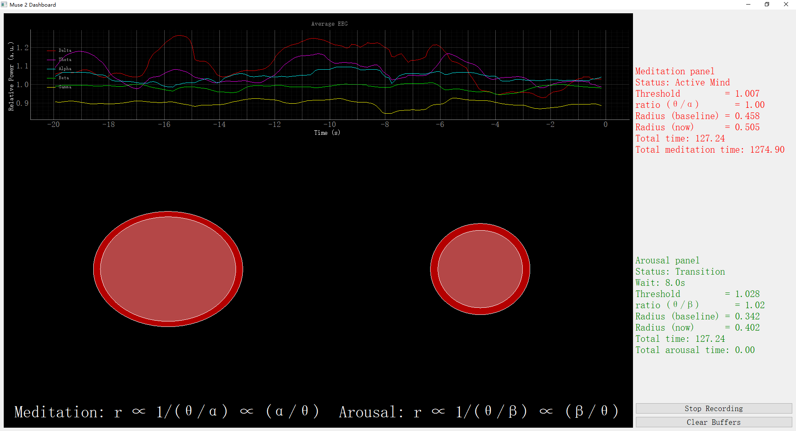
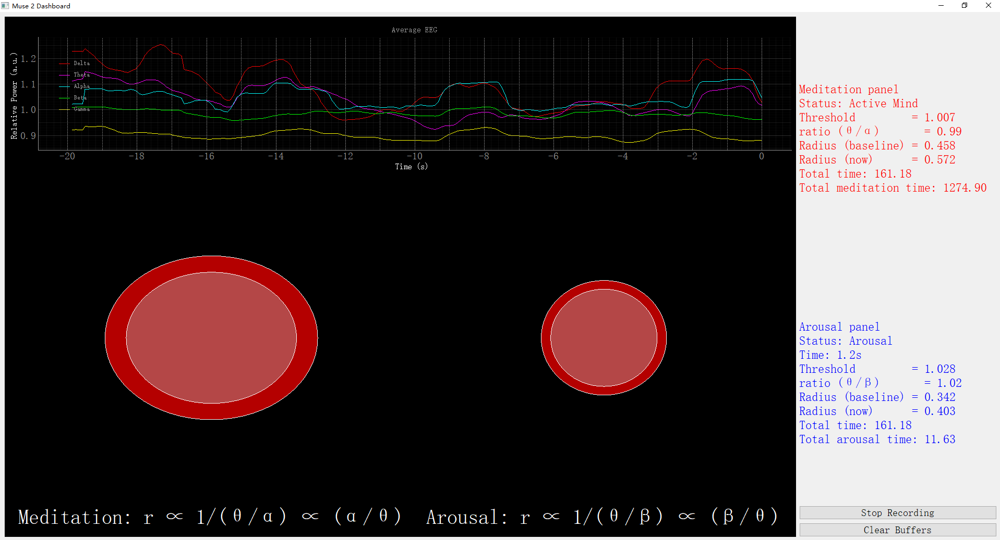

# Muse 2 EEG Meditation and Arousal Biofeedback System

This project provides a real-time EEG-based biofeedback system built around the [Muse 2](https://choosemuse.com/products/muse-2) headset. It leverages Python and OSC (Open Sound Control) via the Mind Monitor app to track brainwave activity, enabling users to enter and maintain meditative or aroused states through visual and auditory feedback.

Arousal detection in this system is based on a decrease in the theta/beta ratio, reflecting increased high-frequency (beta) activity and reduced low-frequency (theta) activity, typically associated with alertness or stress.

Meditation detection in this system is based on an increase in the theta/alpha ratio, reflecting stronger low-frequency (theta) activity relative to alpha. This pattern is often associated with relaxed awareness, internal focus, and meditative states.

## ✨ Features

- Real-time EEG signal acquisition via Mind Monitor
- Dynamic theta/alpha or theta/beta ratio-based feedback
- Visual biofeedback using a growing/shrinking circle, live EEG curves, and state transitions
- Built-in calibration and burn-in phases for robust baseline estimation
- Intuitive GUI interface powered by PyQtGraph and Pygame
- Multi-phase cognitive state detection:
  - Configuration → Burn-in → Calibration → Idle/Neutral → Transition → Meditation or Arousal

## 🧠 Cognitive State Flow

The system supports the following six key states:

| State | Screenshot | Comment |
|-------|------------|---------|
| 0. Configuration |  | User sets session parameters and prepares headset |
| 1. Burn-in Phase |  | User waits while the system stabilizes before calibration begins |
| 2. Calibration |  | System calibrates thresholds for meditation and arousal |
| 3. Idle/Neutral |  | No dominant mental state detected yet (neutral monitoring) |
| 4. Transition to Meditation |  | Emerging meditative EEG features (increased theta/alpha) cause the left feedback circle to contract. |
| 5. Meditation |  | Stable meditative state detected (e.g., high theta/alpha) |
| 6. Transition to Arousal |  | Emerging arousal-related EEG features (decreased theta/beta) cause the right feedback circle to expand. |
| 7. Arousal |  | Elevated arousal state detected (low theta/beta) |

> These screenshots illustrate the adaptive flow of the system as it dynamically tracks and responds to mental state shifts between relaxation and heightened arousal.

---

## How to Run

Follow these steps to set up and launch the system:

### 1. Create a Conda environment
conda create --name muse2biofeedback python=3.12.4 pip

### 2. Activate the created Conda environment
conda activate muse2biofeedback

### 3. Install required dependencies
pip install -r requirements.txt

### 4. Start the Program
**Once the environment is set up and all dependencies are installed, you can launch the system**

python muse2_arousal_meditatation_biofeedback.py

